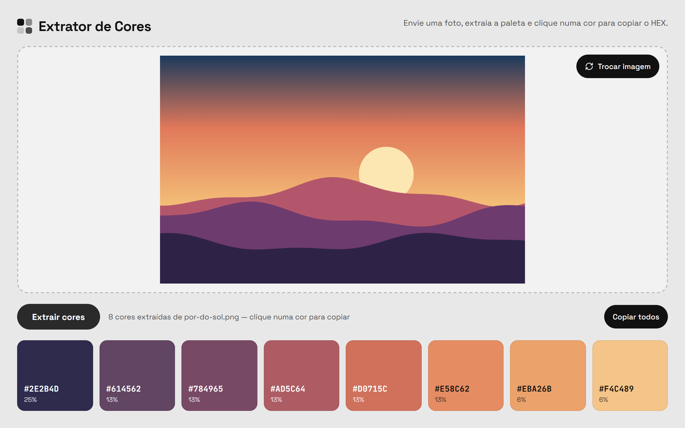

# Extrator de Cores

Aplicação web que extrai a paleta de cores predominantes de uma imagem. Envie uma foto, clique em **Extrair cores** e clique numa cor para copiar o código HEX.

Tudo roda no navegador: a imagem nunca sai do seu computador.



## Funcionalidades

- Upload por arrastar e soltar ou pelo seletor de arquivos (JPG, PNG, WEBP, GIF)
- Extração de até 8 cores com o algoritmo *median cut*
- Percentual de presença de cada cor na imagem
- Texto da amostra em preto ou branco, conforme o contraste com a cor
- Cópia de uma cor ou de todas de uma vez (`#111111, #8A8A8A, ...`)
- Layout responsivo

## Tecnologias

- [TypeScript](https://www.typescriptlang.org/) em modo `strict`
- [Vite](https://vite.dev/) para desenvolvimento e build
- [Bun](https://bun.sh/) como gerenciador de pacotes e runtime
- HTML, CSS e DOM puros, sem framework

## Começando

Pré-requisito: [Bun](https://bun.sh/) 1.2 ou superior.

```bash
bun install
bun run dev
```

O navegador abre automaticamente em `http://localhost:5173`.

### Scripts

| Comando             | Descrição                                        |
| ------------------- | ------------------------------------------------ |
| `bun run dev`       | Servidor de desenvolvimento com recarga automática |
| `bun run build`     | Checa os tipos e gera o build de produção em `dist/` |
| `bun run preview`   | Serve o conteúdo de `dist/` localmente           |
| `bun run typecheck` | Apenas a checagem de tipos                       |

## Estrutura

```
src/
├── main.ts              # Ponto de entrada: estado da aplicação e ligação dos módulos
├── config.ts            # Parâmetros ajustáveis da extração
├── types.ts             # Tipos compartilhados
├── core/                # Lógica pura, sem dependência do DOM
│   ├── color-utils.ts   #   Conversão para HEX, luminância, contraste
│   ├── median-cut.ts    #   Algoritmo de quantização
│   └── palette.ts       #   Pixels → paleta pronta para exibição
├── services/            # Acesso a APIs do navegador
│   ├── image-loader.ts  #   Leitura do arquivo e amostragem de pixels via canvas
│   └── clipboard.ts     #   Cópia para a área de transferência
├── ui/                  # Renderização e eventos
│   ├── dom.ts           #   Referências tipadas aos elementos
│   ├── dropzone.ts      #   Arrastar e soltar + seletor de arquivo
│   └── palette-view.ts  #   Amostras de cor e estado dos botões
└── styles/              # CSS por camada e componente
```

As dependências seguem um único sentido: `main` → `ui` / `services` → `core`. A pasta `core/` não toca no navegador, o que facilita testar e reaproveitar o algoritmo.

## Como funciona a extração

1. A imagem é redimensionada para no máximo 160 px no maior lado e desenhada num `<canvas>`.
2. Os pixels quase transparentes (alpha < 125) são descartados.
3. O *median cut* divide os pixels em grupos, sempre partindo o grupo com maior variação de cor, até chegar a 8 grupos.
4. A cor de cada grupo é a média dos seus pixels. Cores muito parecidas são fundidas.
5. As cores são ordenadas da mais presente para a menos presente.

## Configuração

Os parâmetros ficam em [`src/config.ts`](src/config.ts):

| Constante          | Padrão | Efeito                                              |
| ------------------ | ------ | --------------------------------------------------- |
| `COLOR_COUNT`      | `8`    | Quantidade de cores na paleta                       |
| `SAMPLE_SIZE`      | `160`  | Maior lado (px) da imagem analisada                 |
| `ALPHA_THRESHOLD`  | `125`  | Pixels com alpha abaixo disso são ignorados         |
| `MERGE_DISTANCE`   | `18`   | Distância RGB abaixo da qual duas cores são fundidas |
| `COPY_FEEDBACK_MS` | `1400` | Tempo que o aviso "Copiado!" fica visível           |

## Deploy

O comando `bun run build` gera arquivos estáticos em `dist/`, que podem ser publicados em qualquer hospedagem estática (GitHub Pages, Netlify, Vercel, Cloudflare Pages etc.).
